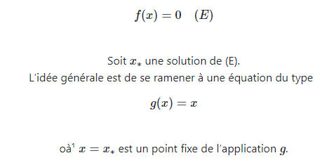
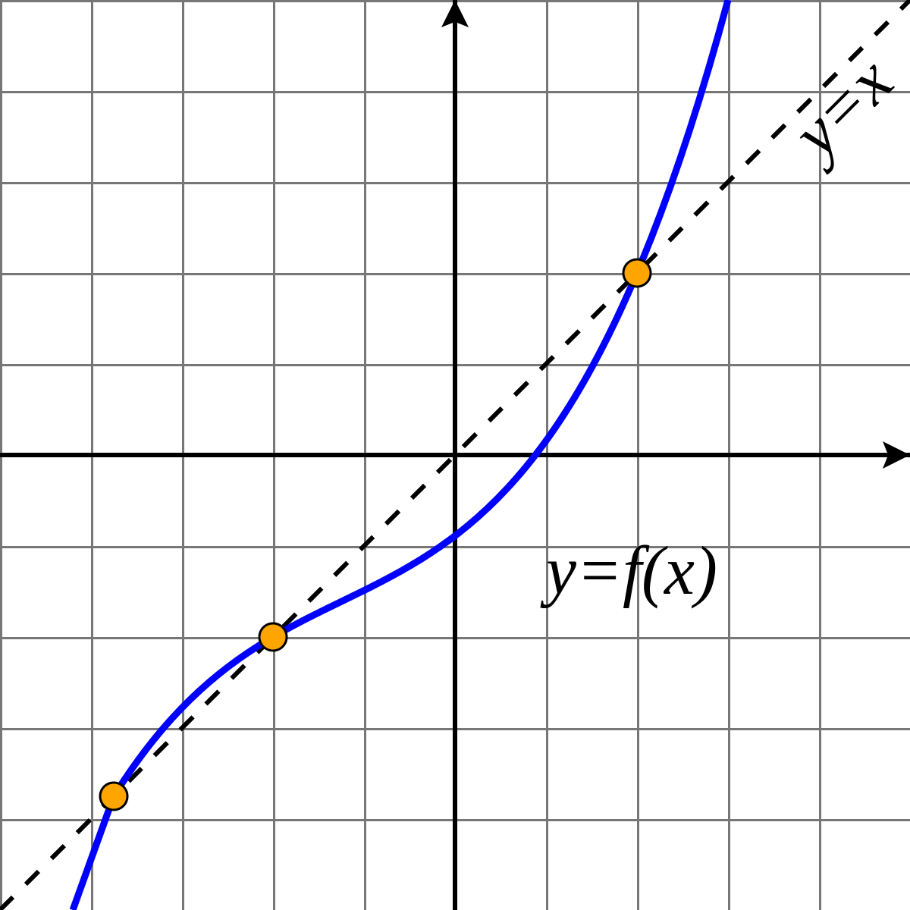

# Résolution d'une équation non linéaire
# Sommaire :
 - [Introduction](#introduction)
 - [Méthode dichotomie](#méthode-dichotomie)
 - [Méthode du point fixe](#Méthode-du-point-fixe)
 - [Méthode de Newton](#Méthode-de-Newton)
 - [Comparaison](#comparaison)
 - [Conclusion](#conclusion)

## Introduction 
> Dans ce TP on va étudier des différents méthodes des résolutions d'une équation non linéaire.
## Méthode dichotomie
> La méthode de dichotomie ou méthode de la bissection est, en mathématiques, un algorithme de recherche d'un zéro d'une fonction qui consiste à répéter des partages d’un intervalle en deux parties puis à sélectionner le sous-intervalle dans lequel existe un zéro de la fonction.

.

> + 1) Avantages de la méthode de la dichotomie :

    -simple
    -vitesse de convergence constante
    -On peut calculer nombre d'itérations facilement si on connait epsilon.
    -L’erreur dans la methode de la dichotomie ne depend pas de f.

> + 2) Inconvénients de la méthode de la dichotomie :

    - lente
    - nécessite f (a) × f (b) < 0
    - nécessite la continuité
    
## Méthode du point fixe 
>La méthode du point fixe appliquée à la résolutions d’équations non linéaires
consiste à élaborer un schéma itératif, en l’occurence une suite convergente vers un point fixe x d’une certaine application g, ce point fixe est en l’occurence
la solution de l’équation f(x)=0.
L’objectif ce méthode est la résolution d’équation du type :

  
   

> + 1) Avantages de la méthode point fixe : 

    -Ne demande pas le calcule de f'.
> + 2) Inconvénients de la méthode point fixe :

    -Choix de g de manière algébrique
## Méthode de Newton
> La méthode de Newton est basée sur la construction d’une suite (xn) qui converge vers un zéro
α d’une fonction continue f : [a, b] → R. Nous allons voir que le point initial x0 ∈ [a, b] de cette
suite doit etre choisi suffisamment proche de α pour que la méthode converge.
      
      -La méthode de newton est une cas particulier de la méthode de point fixe.

.

> + 1) Avantages de la methode de newton 

     -L'avantage majeur de la méthode de Newton par rapport à une méthode de point fixe par exemple est sa vitesse de convergence d'ordre 2.
> + 2) Inconvénients de la methode de newton :

     -Dépend de la fonction f et son dérivé.
## Comparaison
>
(a) Pour comparer les algorithmes, il est important de tenir compte de la présence ou non des facteurs suivants :

assurer de la convergence ainsi que la vitesse

stabilité de l'algorithme revient à la précision des résultats

effcacité des calculs (ex : nombre de fonctions à calculer à chaque itération).

(b) La méthode de point fixe a surtout un interêt théorique : son analyse mathématique est relativement aisée et nous a permis d'en déduire celle de la méthode de Newton qui en est en fait un cas particulier.

(c) La méthode de Newton a généralement la faveur des utilisateurs : elle est effectivement très rapide et est certainement à conseiller lorsque le calcul de f' est aisé et lorsque des remarques simples permettent de choisir à coup sûr la donnée initiale dans le domaine de convergence. Pour cela, elle peut être, par exemple, précédée d'une application de quelques itérations de la méthode de dichotomie.
## Conclusion
> La comparaison Peut Pas etre juste completement car chaque method peut etre plus efficace que d'autre dans des cas precis que d'autre methode sont pas vraiment efficace et avec prise en consideration les algorithmes utilisé on trouve que la methode de point fixe genére un resultat plus rapide que l'autre methode Newton L’avantage majeur de la méthode de Newton par rapport à une méthode de point fixe par exemple est sa vitesse de convergence d’ordre 2. On peut d’ailleurs remarquer que lorsque la méthode ne converge pas, par exemple si l’itéré initial x(0) n’a pas été choisi “suffisamment proche” de x, alors la méthode diverge très vite

