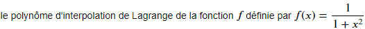

# TP2 :Interpolation polynomiale
# Sommaire :
 - [Introduction](#introduction)
 - [Formule de Lagrange](Formule-de-Lagrange)
 - [Formule de Newton](Formule-de-Newton)
 - [Conclusion](#conclusion)
## Introduction
> En analyse numérique, l’interpolation polynômiale est une technique d’interpolation d’une fonction par un polynôme. Etant donnés une fonction f : [a, b] -> R et N > 1 un entier naturel. Soint x0, x1, · · · , xN (N + 1) points (appelés aussi des noeuds) deux à deux distincts dans [a, b]. Le but est de chercher à trouver un polynôme p (à coefficients réels) vérifiant le système suivant :  

    -Il existe un unique polynome p vérifiant le systéme précedent.
## Formule de Lagrange

>L’unique polynôme vérifiant le systéme précedent, appelé le polynôme d’interpolation de Lagrange, s’écrit sous la forme suivante :

On a les propriètés suivantes :

- Li (x) est un polynôme de degré égal (exactement) à N.

> *  Exemple :
 

La répresentation graphique de la fonction :

L'application de la formule de lagrange : 

### Interpolation Equidistante :
### Interpolation Tchebycheff: 

## Formule de Newton
## Conclusion
