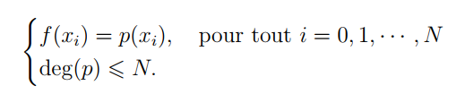

# TP2 :Interpolation polynomiale
# Sommaire :
 - [Introduction](#introduction)
 - [Formule de Lagrange](Formule-de-Lagrange)
 - [Formule de Newton](Formule-de-Newton)
 - [Conclusion](#conclusion)
## Introduction
> En analyse numérique, l’interpolation polynômiale est une technique d’interpolation d’une fonction par un polynôme. Etant donnés une fonction f : [a, b] -> R et N > 1 un entier naturel. Soint x0, x1, · · · , xN (N + 1) points (appelés aussi des noeuds) deux à deux distincts dans [a, b]. Le but est de chercher à trouver un polynôme p (à coefficients réels) vérifiant le système suivant :  

    -Il existe un unique polynome p vérifiant le systéme précedent.
## Formule de Lagrange

>L’unique polynôme vérifiant le systéme précedent, appelé le polynôme d’interpolation de Lagrange, s’écrit sous la forme suivante :

p(x) =Σf (xi )Li (x) = f (x0)L0(x)+f (x1)L1(x)+· · ·+f (xN)LN(x),
avec

$L_{i}(x)=\displaystyle\frac{(x-x_1)(x-x_2)\ldots(x-x_{i-1})(x-x_{i+1})\ldots(x_0-x_{n})}{(x_i-x_0)(x_i-x_1)\ldots(x_i-x_{i-1})(x_i-x_{i+1})\ldots(x_i-x_{n})}$ pour $i\in \{1,\ldots,n\}$

On a les propriètés suivantes :

- Li (x) est un polynôme de degré égal (exactement) à N.

## Formule de Newton
## Conclusion
