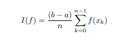
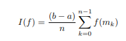
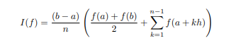
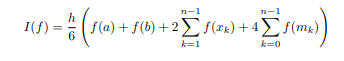
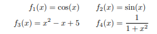
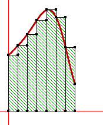

# PROJET ANALYSE NUMERIQUE
# Intégration Numérique
# Sommaire :
 - [Introduction](#introduction)
 - [Méthode des réctangles](#Méthode-des-réctangles)
 - [Méthode du point milieu](#Méthode-du-point-milieu)
 - [Méthode des trapèzes](Méthode-des-trapèzes)
 - [Méthode de Simpson](#Méthode-de-Simpson)
 - [Mini projet](#Mini-projet)
 - [Conclusion](#conclusion)
## Introduction
> L'intégration est un des problèmes les plus importants que l'on rencontre en analyse. En effet, on rencontre souvent des intégrales dont le calcul par des méthodes analytiques est trés compliqué ou meme impossible, car il n'existe pas d'expression analytique d'une primitive de la fonction à intégrer.
    
> Dans ces cas, on peut appliquer des méthodes composites pour evaluer la valeur de l'integrale
donnée.
> On appelle formule composite l’expression caractérisant cette estimation.
Notons k l’indice des n sous-intervalles, h = (b − a)/n la longueur de chacun d’eux, xk = a + kh la borne inférieure et
mk = a + (k + 1/2)h le point milieu, ceci pour k entre 0 et n − 1.Voici quelques formules composites :
- Méthode des réctangles :

- Méthode du point milieu :

- Méthode des trapèzes :

- Méthode de Simpson :

> soit les 4 fonctions suivantes :

           
    - Le but de ceTP est de comparer ces 4 méthode d’intégrations numériques.
## Méthode des rectangles à gauche :
> La plupart des méthodes d'intégration numérique fonctionnent sur le même principe. On commence par couper le gros intervalle [a,b] en N plus petits intervalles [ai,ai+1], avec a1=a et aN+1=b. Puis, pour chaque intervalle [ai,ai+1], on essaie d'approcher . Les moyens les plus simples sont :
la méthode des rectangles à gauche : on approche  par . Géométriquement, cela signifie qu'on approche l'intégrale de f par l'aire des rectangles hachurés en vert :

 

